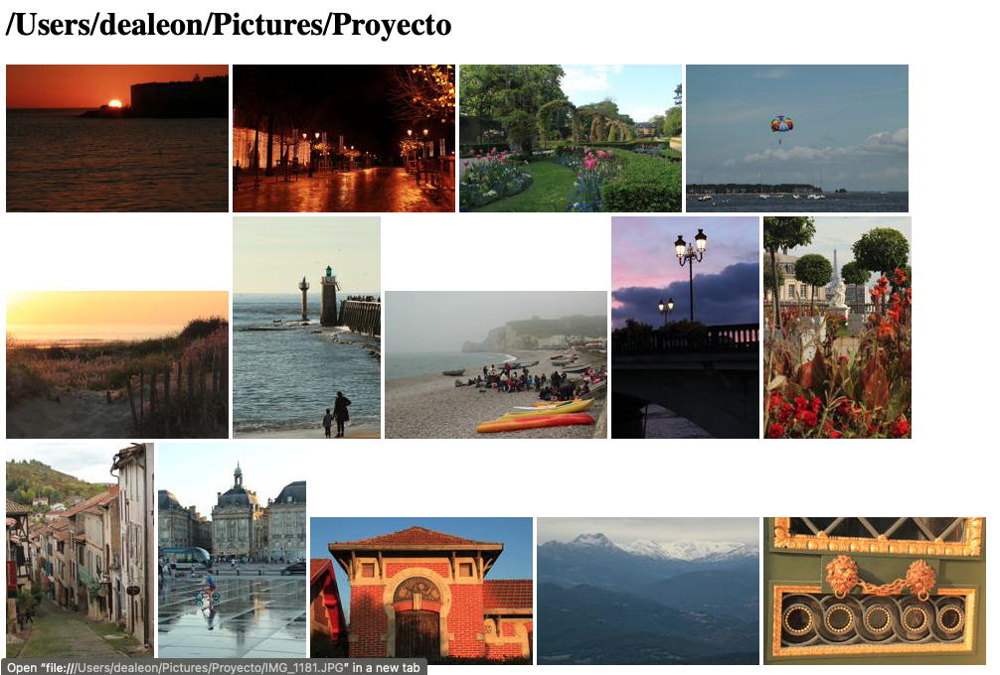

# Photo project - Proyecto Fotos

This tool reads all photos from a directory and creates an html file with scaled down versions of those photos. The original photo will be shown if its thumbnail is clicked.
The scaled down copies of the photos are stored in another directory.

The directory where the original photos will be searched, can have as many subdirectories underneath as needed. You could search the whole hard disk if you wanted (Be aware that it can take several minutes. Start with a small example if you wish).

I did this simple tool because I did not like the way that the mac's "Photos" program works: It merges all the photos into a huge file and if I want to see where the original photo is located it is complicated. I want the original photo to manipulate it, share it, print it or whatever.

The code is not complicated, but it is useful and reliable. I can find all my photos.

I have only tested the scripts with a mac.

## To see the example output:

The file ***output.html*** is an example with just one photo. It can be opened with any browser.

If you don't want to clone or copy the project to your local machine, but want to see the example, you still need the subdirectories of ***Dir_scaled*** and ***Dir_de_prueba***.

## Installation

If you want to clone it, use this git command from a terminal or console:

git clone  https://github.com/DeaMariaLeon/Proy_fotos.git

I used:

- Python 3.10.4
- beautifulsoup4==4.11.1
- numpy==1.22.4
- pathlib==1.0.1
- Pillow==9.1.1

There is a file ***requirements.txt*** that you can use if you want to use pip.
First you need to be inside the project's subdirectory with:

cd name_of_your_directory

Your environment needs to be active - if you are using one.

To install the requirements file (you should have python 3 already installed by now) you can type:

**pip install -r requirements.txt**

## Inputs:

The inputs are located in the file ***variables.json***. They are:

- The path to the original photos
- The directory to store the scaled-down photos
- The name of the html file to be created. I have it as **output.html**. It can be changed.
Please notice that the directories to your original and scaled-down photos can be outside of your project directory.

## Notes:

- The main program to run is **visualizar_enpython.py.**.

- If you delete the output.html file, you should delete the scaled-down photos from their subdirectory. Otherwise they will stay there and will never be used.

- The program will not modify or include more photos to the output file if the path to the original photos has already been processed.

- To learn how to use vscode with [virtual environments](https://code.visualstudio.com/docs/python/environments#_where-the-extension-looks-for-environments).

- If you don't have git installed, you can visit: [Getting started](https://git-scm.com/book/en/v2/Getting-Started-Installing-Git)

- To work with virtual environments you can use 'venv', which already comes with Python. Or you can use virtualenv, conda, etc.

- It is not necessary to have a virtual environment if you are just playing at this point. But it will save you headaches with versions later on with future projects.

## Improvements planned:

Use a database to store the names of the files and directories.

"Beautify" the output file.

Calculate the space needed to save the new generated html file.

Improve my python code.

## The final product

It will have all the pics. If I click on photo on created html file, I and can open the original large version.

